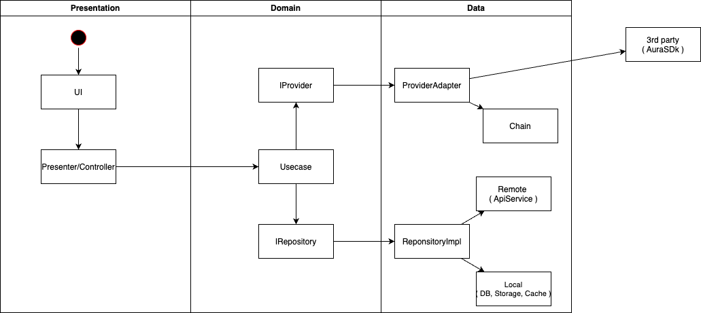
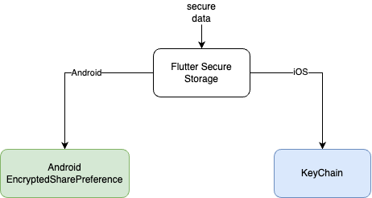
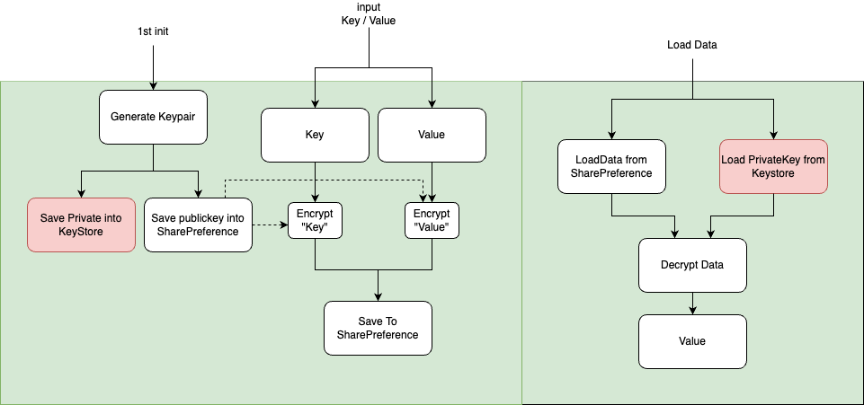
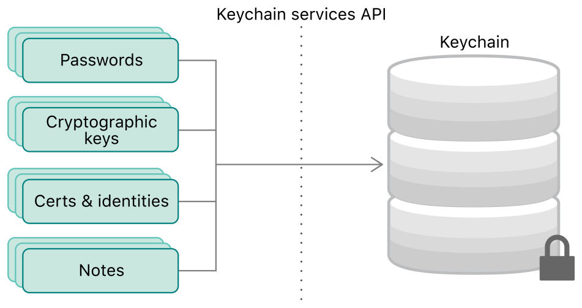

# Pyxis-Mobile Application

## Overview

This mobile application is a Blockchain wallet that allows users to securely manage their cryptocurrencies. The app is built using Flutter framework and follows Uncle Bob's Clean Architecture principles, ensuring a scalable and maintainable codebase.

## Features

- Secure Key Storage: The application utilizes KeyStore System for Android and KeyChain Service for iOS to securely store private keys and sensitive data.

- Clean Architecture: The app is organized using the Clean Architecture pattern, separating business logic from presentation and data layers, making it easier to maintain and test.

- Blockchain Interaction: Users can interact with different blockchain networks to perform transactions, check balances, and view transaction history.

## Getting Started

To run the application locally on your development machine, follow these steps:

1. Clone the repository: `git clone https://github.com/aura-nw/Pyxis-Mobile.git`

2. Install dependencies: `flutter pub get`

3. Generate sub files: `dart pub run build_runner build --delete-conflicting-outputs`

4. Run the app: `flutter run`

## Technology Stack

- Flutter: A cross-platform framework for building mobile applications.

- Clean Architecture: A software design pattern that separates concerns and enforces separation of concerns.
  
- Flutter Secure Storage :
    - KeyStore System (Android): Securely stores private keys and cryptographic keys.
    - KeyChain Service (iOS): Securely stores sensitive data in the iOS keychain.

### Clean Architecture :

For more info, please take a look to [Clean Architecture](https://blog.cleancoder.com/uncle-bob/2012/08/13/the-clean-architecture.html)

### Flutter Secure Storage: [read more](https://pub.dev/packages/flutter_secure_storage)

#### KeyStore System (Android)

#### KeyChain Service (iOS)

## License

This project is licensed under the [MIT License](./LICENSE). Feel free to customize and modify the project according to your needs.
